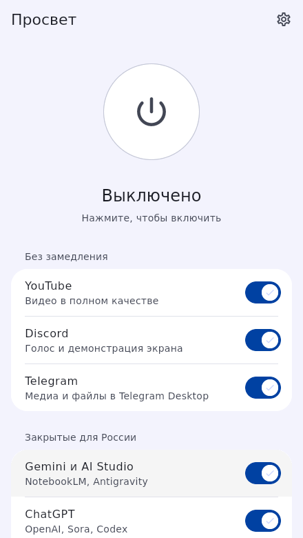
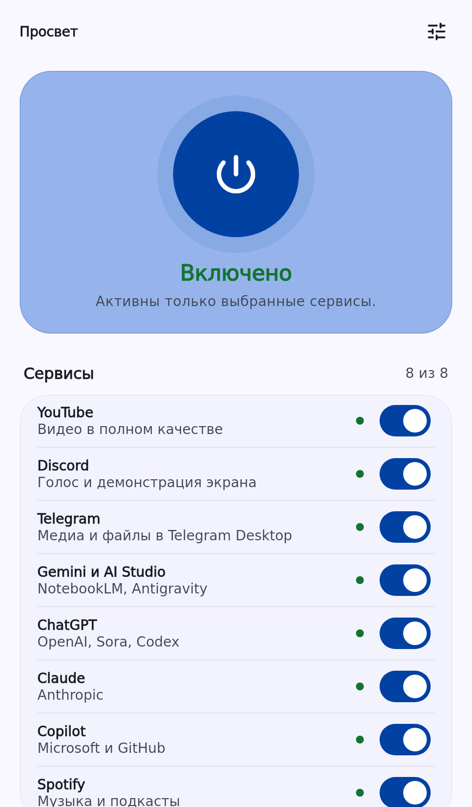
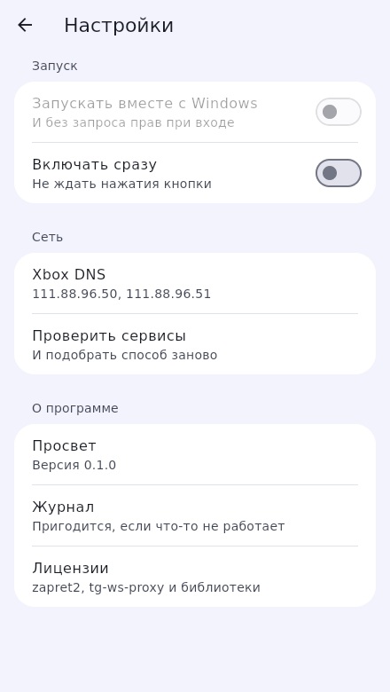

<div align="center">


# Просвет

**Точечный доступ к нужным сервисам без системного VPN.**  
Windows-клиент поверх zapret2, Smart DNS и локального Telegram proxy.

[](https://github.com/levvs-one/zapret2/releases/latest)
[](https://github.com/levvs-one/zapret2/actions/workflows/ci.yml)

[](LICENSE)

**[Скачать последнюю версию](https://github.com/levvs-one/zapret2/releases/latest)** ·
[Установка](docs/getting-started.md) ·
[Чем отличается от zapret2](docs/prosvet-vs-zapret2.md) ·
[FAQ](docs/faq.md) ·
[Диагностика](docs/troubleshooting.md) ·
[Поддержка](SUPPORT.md)

</div>

---

## Что это

Просвет — не ещё одна папка с батниками и не общий VPN-туннель.

Он даёт единый Windows-интерфейс для трёх разных механизмов и включает каждый только там, где он нужен:

| Сервисы | Проблема | Что делает Просвет |
| --- | --- | --- |
| **YouTube, Discord** | DPI / замедление / блокировка трафика | запускает zapret2 через WinDivert только для нужных доменов |
| **ChatGPT, Gemini, Claude, Copilot, Spotify** | региональные ограничения на стороне сервиса | создаёт точечные Windows NRPT-правила и использует Smart DNS |
| **Telegram Desktop** | проблемы с доступом к дата-центрам / медиа | поднимает локальный MTProto-over-WebSocket proxy |

Остальной трафик продолжает идти напрямую.

### В двух словах

- одна кнопка вместо ручной сборки стратегий;
- отдельный переключатель для каждого сервиса;
- рабочая DPI-стратегия запоминается для конкретной сети;
- автоматический cleanup процессов и системных правил;
- tray, автозапуск, installer и portable-сборка;
- без аккаунта, рекламы и телеметрии.

---

## Как выглядит

<p align="center">
  
  &nbsp;&nbsp;
  
  &nbsp;&nbsp;
  
</p>

Интерфейс намеренно небольшой: состояние, список сервисов, диагностика и настройки. Сетевой движок не вываливается на пользователя десятками параметров.

---

## Скачать и установить

Перейдите в **[GitHub Releases](https://github.com/levvs-one/zapret2/releases/latest)**.

| Файл | Для кого |
| --- | --- |
| **`Prosvet-<version>-Setup.exe`** | обычная установка: меню Пуск, uninstall, нормальный lifecycle |
| **`Prosvet-<version>-windows-x64.zip`** | portable-вариант без установки |
| **`SHA256SUMS.txt`** | контрольные суммы релизных файлов |

### Быстрый старт

1. Скачайте Setup из последнего релиза.
2. При желании сверьте SHA-256 по `SHA256SUMS.txt`.
3. Установите Просвет и запустите его.
4. Оставьте включёнными только нужные сервисы.
5. Нажмите кнопку питания.
6. Для Telegram один раз нажмите **«Подключить Telegram Desktop»**.

Полная инструкция, SmartScreen, portable и удаление: **[docs/getting-started.md](docs/getting-started.md)**.

> Бинарники пока не подписаны коммерческим Authenticode-сертификатом. Windows SmartScreen может показать предупреждение о неизвестном издателе. Скачивайте сборки только из GitHub Releases и сверяйте SHA-256, если для вас это важно.

---

## Чем это отличается от обычного zapret2

**zapret2 — низкоуровневый anti-DPI engine. Просвет — готовый Windows-продукт вокруг конкретных пользовательских сценариев.**

| | Просвет | zapret2 напрямую |
| --- | --- | --- |
| Главная задача | открыть поддерживаемые сервисы без ручной настройки | дать максимальную гибкость для обхода DPI |
| UI | готовое Windows-приложение | в основном CLI / конфигурация |
| Стратегии DPI | подбираются и запоминаются приложением | пользователь управляет стратегиями сам |
| Smart DNS | встроен | не является задачей zapret2 |
| Telegram proxy | встроен | не является задачей zapret2 |
| Cleanup / lifecycle | приложение управляет процессами и NRPT | зависит от вашей конфигурации / обвязки |
| Installer / tray / autostart | есть | не является основной целью проекта |
| Гибкость | намеренно ограниченная | значительно выше |
| Роутеры / OpenWRT / BSD | нет | да, zapret2 рассчитан и на эти сценарии |

Если вам нужны произвольные hostlist, свои Lua-стратегии, маршрутизатор или тонкая ручная настройка — используйте **zapret2 напрямую**.  
Если нужно открыть несколько популярных сервисов на Windows и не заниматься ручной конфигурацией — для этого существует Просвет.

Подробное сравнение: **[docs/prosvet-vs-zapret2.md](docs/prosvet-vs-zapret2.md)**.

---

## Что меняется в Windows

Просвет не устанавливает корневые сертификаты, браузерные расширения или собственную системную службу.

При включении он может:

- запустить `winws2.exe` и WinDivert для DPI-сервисов;
- создать NRPT-правила для выбранных Smart DNS доменов;
- запустить локальный Telegram proxy на `127.0.0.1`;
- создать задачу Task Scheduler `Prosvet`, если включён автозапуск;
- хранить настройки и журнал в `%LOCALAPPDATA%\Prosvet`.

При выключении и удалении приложение старается убрать собственное системное состояние. После аварийного завершения cleanup повторяется при следующем запуске.

Подробнее: **[Security](SECURITY.md)** · **[Privacy](PRIVACY.md)**.

---

## Поддерживаемые сервисы

| Сервис | Механизм | Что покрывается |
| --- | --- | --- |
| YouTube | zapret2 / DPI | видео и веб |
| Discord | zapret2 / DPI | веб, голос, демонстрация экрана |
| Telegram Desktop | local proxy | медиа и файлы |
| Gemini / AI Studio / NotebookLM | Smart DNS | домены Google AI |
| ChatGPT / Sora / Codex | Smart DNS | домены OpenAI |
| Claude | Smart DNS | домены Anthropic |
| Copilot | Smart DNS | Microsoft / GitHub Copilot |
| Spotify | Smart DNS | веб и клиентские домены |

Поддержка сервиса не означает изменение региона аккаунта, платёжного профиля или номера телефона. См. **[FAQ](docs/faq.md)**.

---

## Если не работает

Начните с **[диагностики](docs/troubleshooting.md)**.

Самые частые причины:

- браузерный Secure DNS / DoH обходит Windows NRPT;
- одновременно запущен другой VPN, zapret или WinDivert-клиент;
- проблема не в сети, а в регионе аккаунта;
- Telegram proxy ещё не подключён в Telegram Desktop;
- антивирус блокирует WinDivert / `winws2.exe`.

Если проблема остаётся, откройте **[Issue](https://github.com/levvs-one/zapret2/issues/new/choose)** и приложите версию Просвета, Windows, провайдера/тип сети и журнал.

---

## Почему релизу можно доверять больше, чем случайному архиву

Каждый pull request и `main` проходят автоматические проверки:

```text
format
  ↓
flutter analyze
  ↓
unit / widget / lifecycle tests
  ↓
zapret2 parser dry-run
  ↓
Windows release build
  ↓
Setup install / uninstall smoke-test
  ↓
portable artifact
```

Release workflow публикует:

- Setup;
- portable ZIP;
- единый `SHA256SUMS.txt`.

Версия zapret2 фиксирована, а скачиваемый engine проверяется по SHA-256 перед сборкой.

---

## Документация

| Документ | Что внутри |
| --- | --- |
| **[Установка](docs/getting-started.md)** | Setup, portable, SmartScreen, первый запуск, удаление |
| **[Просвет vs zapret2](docs/prosvet-vs-zapret2.md)** | зачем нужен этот проект и где лучше использовать raw zapret2 |
| **[FAQ](docs/faq.md)** | VPN, регионы аккаунтов, Telegram, безопасность, обновления |
| **[Диагностика](docs/troubleshooting.md)** | типовые проблемы и что приложить к issue |
| **[Архитектура](docs/architecture.md)** | lifecycle и устройство движков |
| **[Security](SECURITY.md)** | модель безопасности, release integrity и reporting |
| **[Privacy](PRIVACY.md)** | что хранится локально и что уходит в сеть |
| **[Support](SUPPORT.md)** | куда идти с багом, DPI-отчётом, новым сервисом или вопросом |
| **[Contributing](CONTRIBUTING.md)** | разработка, тесты и правила PR |
| **[Changelog](CHANGELOG.md)** | изменения по версиям |

---

## Для разработчиков

```bash
flutter pub get
dart format --output=none --set-exit-if-changed lib test tool tools
flutter analyze
flutter test
```

UI без системных сетевых изменений:

```bash
flutter run -d windows -- --demo
```

Production build:

```powershell
./tools/fetch-engine.ps1
flutter build windows --release
```

Архитектура: **[docs/architecture.md](docs/architecture.md)**.  
Правила contribution: **[CONTRIBUTING.md](CONTRIBUTING.md)**.

---

## Credits

Просвет использует и развивает идеи нескольких open-source проектов:

- **[bol-van/zapret2](https://github.com/bol-van/zapret2)** — DPI engine;
- **[Flowseal/tg-ws-proxy](https://github.com/Flowseal/tg-ws-proxy)** — Telegram-over-WebSocket approach;
- **[Xbox DNS](https://xbox-dns.ru)** — Smart DNS provider.

Сторонние лицензии: **[THIRD_PARTY_NOTICES.md](THIRD_PARTY_NOTICES.md)**.

---

<div align="center">

**Просвет** · Windows 10/11 · MIT License · no telemetry

[Releases](https://github.com/levvs-one/zapret2/releases/latest) ·
[Issues](https://github.com/levvs-one/zapret2/issues) ·
[Security](SECURITY.md) ·
[Support](SUPPORT.md) ·
[Changelog](CHANGELOG.md)

</div>
